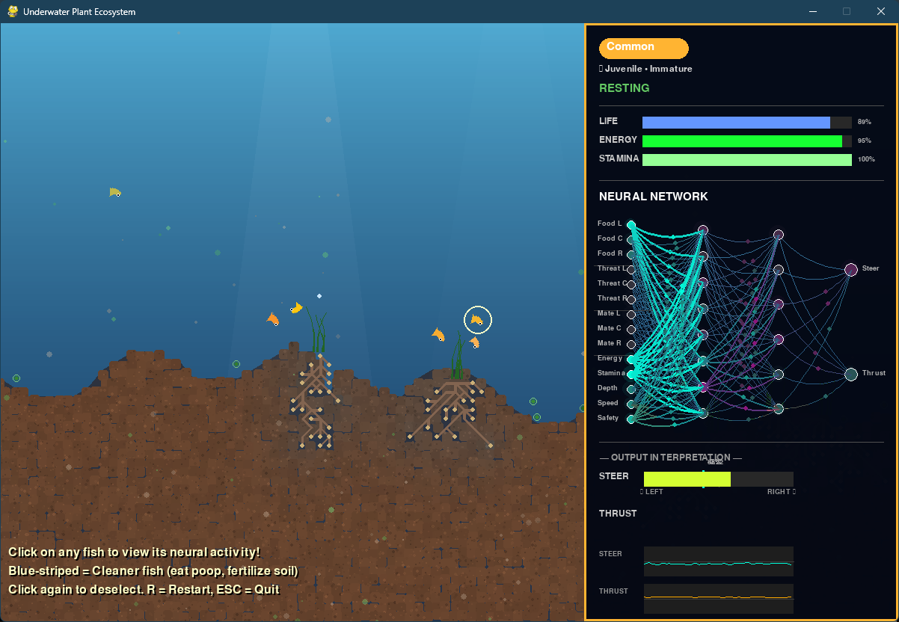

# 🌊 Underwater Neural Ecosystem Simulation



A passion project by a self-taught hobbyist developer – an evolving Python/Pygame simulation of a living underwater lake ecosystem. Watch emergent behaviors unfold as neural network-driven fish interact with dynamic plants, roots, soil nutrients, and each other!

  

## 📋 About This Project

I'm a self-taught programmer who started this as a fun way to explore artificial life, neural networks, procedural generation, and ecosystem dynamics. What began as a simple underwater scene with swaying plants has grown (organically!) into a complex simulation featuring:

### 🧠 Neural Fish AI


- Custom feed-forward neural networks (from scratch – no external ML libraries)
- Real-time **brain visualization**: Click any fish to see its neural activity, inputs, hidden states, and outputs
- Evolutionary traits inherited and mutated across generations
- Emergent behaviors: hiding in plants, family protection, mating, fleeing, and more

### 🐟 Three Fish Species

- **🟠 Common Fish**: Plankton-eating herbivores that form protective family groups
- **🔵 Cleaner Fish**: Scavengers that eat waste (poop particles) and fertilize the soil
- **🔴 Predator Fish**: Hunters with a high-speed dash ability – they only prey on smaller fish

### 🌱 Living Plants & Ecology

- Depth-based plant types: Kelp (shallow), Seagrass (mid), Algae (deep)
- Detailed **root systems** that seek nutrients and transport them upward
- Nutrient cycling: Fish waste → soil fertilization → plant growth → more plankton
- Seed dispersal, growth stages, flowering, decomposition, and visual effects (bubbles, floating leaves)

### 🎨 Visuals & Immersion

- Procedural terrain with beach slopes and deep lake bottom
- Volumetric light rays, water gradient, haze, and animated surface ripples
- Organic soil rendering with nutrient-based colors and sparkles
- Particle systems for plankton, sediment, poop, bubbles, and decomposition

See screenshots, architecture diagrams, and brain visualization flowcharts in the **`docs/`** folder!

## 🚀 Project Evolution (My Learning Journey)

This project grew iteratively as I taught myself new concepts:

- **v0.1.0 (December 2024)**: Basic underwater world – procedural terrain, depth-based water gradient, swaying plants (kelp, seagrass, algae), floating particles. (See `docs/v0.1.0-*`)
- **Later additions**: Dynamic root systems, soil nutrient grid, seed dispersal, plant life cycles
- **Fish introduction**: Steering physics, state machine behaviors, family groups
- **Neural AI**: Custom neural net, radar sensors, real-time brain viewer
- **Species expansion**: Cleaner fish (ecosystem helpers), predators with dash hunts
- **Polish**: Heritable traits, better visuals, brain panel enhancements (see `docs/v0.4.1-Brain-Viewer*` and sequence diagrams in `docs/brain-view-*`)

It's been an incredible self-taught adventure – from simple lines to emergent complexity!

## 🎮 Quick Start

### Prerequisites

- Python 3.8+
- Pygame

### Installation & Run

```bash
git clone https://github.com/TheRealFREDP3D/underwater-sim.git
cd underwater-sim
pip install -r requirements.txt
python main.py
```

## 🎮 Controls

| Key        | Action                             |
| ---------- | ---------------------------------- |
| Left Click | Select/deselect fish to view brain |
| R          | Regenerate world & ecosystem       |
| ESC        | Quit                               |

## 🔧 Customization

All parameters in `config.py` – tweak populations, speeds, neural sizes, colors, etc.

## 🚀 Future Ideas

As a hobbyist, here are features I'm excited to add someday:

- Day/night cycle affecting behavior and visibility
- More environmental events (currents, temperature changes)
- Cooperative behaviors or schooling
- Export ecosystem stats or recordings
- Sound effects and music
- Port to a web version?

Contributions, suggestions, or just sharing your cool ecosystem runs are welcome!

## 📝 License

MIT License – Free to use, modify, and learn from!

## 🙏 Acknowledgments

Built entirely by a self-taught enthusiast exploring AI, simulation, and nature. Inspired by classic artificial life projects and real marine biology.

---

Made with curiosity and code 🌊🧠 by [TheRealFREDP3D](https://therealfred.ca)
