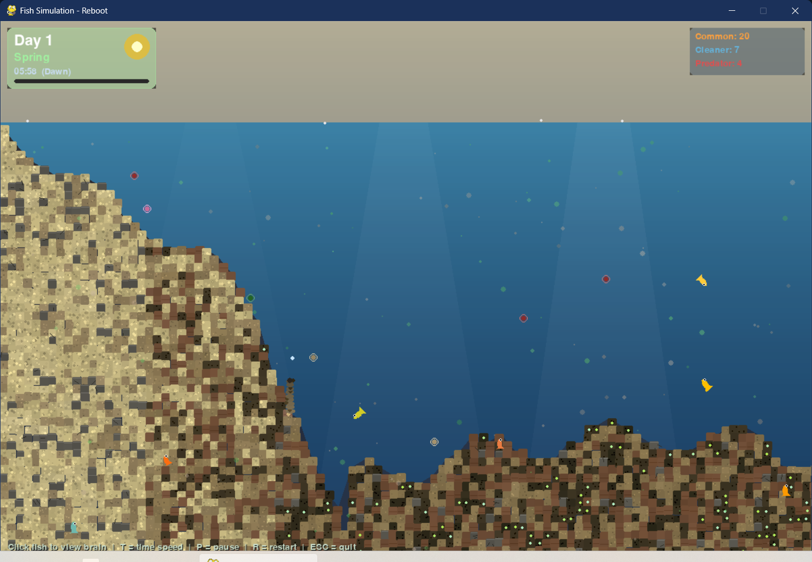

# Underwater Ecosystem Simulation v0.2.0

> "Evolving neural fish in a living underwater ecosystem — built from scratch in pure Python + Pygame"


An underwater ecosystem simulation featuring **improved neural network-driven fish** with temporal memory, dynamic plant growth, real-time brain visualization, and a full day/night + seasonal cycle system.



## 🌊 Features

### 🌙 Day/Night & Season System *(new)*

- **Day/Night Cycle**: Full 24-hour cycle with smooth dawn, midday, dusk, and night phases
- **Dynamic Sky**: Sky colour shifts from deep blue-black at midnight → orange/pink at dawn → brilliant blue midday → amber dusk → starry night
- **Stars**: Twinkling star field visible at night that twinkles and parallaxes across the world
- **Volumetric Lighting**: Light rays appear during the day and fade to nothing at night
- **Night Overlay**: Dark ambient overlay deepens as the sun sets, giving a genuine sense of depth
- **Bioluminescence**: Fish and plant tips glow faintly at night — common fish in cool white, cleaners in teal, predators in red
- **Four Seasons**: Spring → Summer → Autumn → Winter cycling every 7 in-game days
  - **Spring**: Nutrient upwelling, peak mating drive, high plant growth
  - **Summer**: Peak predator activity, strongest sunlight, fastest fish metabolism
  - **Autumn**: Heavy seed dispersal, amber sky tint, falling leaf particles
  - **Winter**: Reduced metabolism (fish become sluggish), plants enter partial dormancy, snow crystal particles
- **Plankton Diel Migration**: Plankton migrate toward the surface during the day and sink to depth at night, just as they do in real oceans
- **Time Controls**: Press **T** to cycle through 1× / 3× / 6× speed; press **P** to pause


### **Neural Fish System - Improved Architecture**
- **Multiple Fish Species**: Regular fish, cleaner fish (cyan-striped), and predators (red)
- **Enhanced Neural Networks**: Each fish has a recurrent neural network with temporal memory for learning patterns
  - **27 inputs**: Radar sensors + physiology + environment + temporal context (time, season, previous state, hunger memory)
  - **14→8 hidden neurons** with tanh activation and recurrent connections
  - **9 outputs**: Movement (steer, thrust), behavior drives (hide/clean/ambush, sprint/dash), and state probabilities
- **Real-time Brain Visualization**: Click on any fish to see its neural activations, recurrent pulses, temporal context, and output gauges
- **Temporal Memory**: Fish remember their previous state and hunger patterns, enabling learned behaviors
- **Layer-specific Evolution**: Different mutation rates for input, hidden, output, and recurrent layers
- **Life Stages**: Larva → Juvenile → Adult → Elder, each with distinct behaviours and display labels
- **Seasonal Behaviour**: Mating drives surge in Spring, fish slow and conserve energy in Winter, predators peak in Summer


### **Dynamic Plant Ecosystem**
- **Three Plant Types**: Kelp (deep water), seagrass (mid-depth), and algae (shallow) with unique growth patterns
- **Root Systems**: Complex underground root networks that actively seek nutrient-rich soil cells
- **Soil Nutrient System**: Dynamic soil fertility shaped by fish waste decomposition and plant death
- **Photosynthesis**: Plants only convert nutrients efficiently during daylight; winter reduces photosynthesis further
- **Seed Distribution**: Plants reproduce by releasing seeds that drift and settle on suitable terrain; seed dispersal spikes in Autumn
- **Realistic Physics**: Plants sway with simulated water currents, responding to depth and energy level

### **Environmental Systems**
- **Particle Effects**: Sediment, plankton, bubbles, leaf particles (Autumn), and snow crystals (Winter)
- **Light Rays**: Dynamic volumetric lighting that fades at dusk and is absent at night
- **Camera System**: Smooth camera tracking that follows a selected fish across the scrollable world
- **Terrain Zones**: Procedurally generated beach slope, mid-water shelf, and deep-water floor

### **Ecological Interactions**
- **Cleaner Fish**: Mutualistic cleaning behavior - actively seek client fish, clean them for energy, and scavenge waste
- **Predator-Prey Dynamics**: Aggressive predators with dash mechanics, ambush behavior, and seasonal activity patterns
- **Blood Effects**: Visual feedback when predators bite prey, with damage-based hunting system
- **Dead Fish Decomposition**: Fish corpses sink and decompose, returning nutrients to the soil
- **Nutrient Cycling**: Waste decomposition enriches soil, feeding plants that shelter fish
- **Population Balance**: Per-species population caps with predator-prey ratio enforcement
- **Family Units**: After hatching, parents temporarily stay near offspring until they mature

## 🎮 Controls

| Input | Action |
|---|---|
| **Left Click** | Select a fish to view its brain panel |
| **Left Click** (empty space) | Deselect fish |
| **T** | Cycle time speed (1× → 3× → 6× → 1×) |
| **P** | Pause / resume the simulation |
| **R** | Regenerate the world |
| **ESC** | Quit |

## 🚀 Installation

### Prerequisites
- Python 3.8 or higher
- pip package manager

### Setup
1. Clone the repository:
```bash
git clone https://github.com/TheRealFREDP3D/fish-sim-reboot.git
cd fish-sim-reboot
```

2. Install dependencies:
```bash
pip install -r requirements.txt
```

3. Run the simulation:
```bash
python main.py
```

*Optional: For development with editable install:*
```bash
pip install -e .
```

## 📁 Project Structure

The project now uses a clean `src/` layout for better organization and packaging:

```bash
fish-sim-reboot/
|-- main.py                  # Thin launcher for easy execution
|-- setup.py                 # Package configuration for pip install
|-- requirements.txt         # Python dependencies (pygame)
|
|-- src/                     # Main package directory
|   `-- fish_sim/           # Importable package (fish_sim)
|       |-- __init__.py      # Package version and metadata
|       |-- main.py          # Core simulation logic
|       |-- config.py        # All configuration constants
|       |-- time_system.py   # Day/night cycle, seasons, bioluminescence
|       |
|       |-- core/           # Core simulation engine
|       |   |-- world.py     # World generation, terrain, sky, stars
|       |   |-- camera.py    # Smooth camera system
|       |   |-- particles.py # Sediment and plankton systems
|       |   `-- environment_objects.py # Environmental objects
|       |
|       |-- fish/           # All fish-related logic
|       |   |-- fish_base.py     # Base NeuralFish class
|       |   |-- fish_system.py    # Population manager
|       |   |-- fish_traits.py    # Heritable genetic traits
|       |   |-- fish_physics.py   # Steering physics
|       |   |-- neural_net.py     # Recurrent neural networks
|       |   |-- cleaner_fish.py   # Cleaner fish subclass
|       |   |-- predator_fish.py  # Predator subclass
|       |   `-- family.py         # Family bonding system
|       |
|       |-- plants/         # Plant & ecology systems
|       |   |-- plants.py           # Plant rendering and management
|       |   |-- plant_development.py # Plant lifecycle
|       |   |-- plant_rules.py      # Plant validation logic
|       |   |-- roots.py            # Root network systems
|       |   `-- seeds.py            # Seed dispersal
|       |
|       |-- environment/    # Environment systems
|       |   `-- soil.py     # Soil grid with nutrients
|       |
|       `-- ui/            # User interface
|           `-- brain_visualizer.py # Neural network visualization
|
|-- doc/                     # Documentation and screenshots
|-- music/                   # Game music files
`-- README.md               # This file
```

## 🧠 Neural Network Architecture

Each fish runs a recurrent neural network every frame with temporal memory:
```
Inputs (27)  →  Hidden 1 (14, tanh)  →  Hidden 2 (8, tanh + recurrent)  →  Outputs (9)
```

### **Input Layer (27 neurons)**

| # | Input | Description |
|---|---|---|
| 0–8 | **Radar Sensors** | Food/Threat/Mate detection in Left/Centre/Right sectors |
| 9–12 | **Physiology** | Energy, Stamina, Depth, Speed (all normalized 0-1) |
| 13–16 | **Environment** | Cover quality, Plant food availability, Plant distance, Ambush alert |
| 17 | **Mate Distance** | Normalized distance to nearest viable mate |
| 18–19 | **Temporal Context** | Time of day, Season (Spring=0.25, Summer=0.5, Autumn=0.75, Winter=1.0) |
| 20–24 | **Previous State** | One-hot encoding of previous behavior state (5 values) |
| 25 | **Hunger Memory** | Time since last meal (normalized) |
| 26 | **Life Stage** | Age normalized by maximum lifespan |

### **Output Layer (9 neurons)**
| # | Output | Range | Effect |
|---|---|---|---|
| 0 | Steer | –1 → +1 | Rotational heading offset |
| 1 | Thrust | 0 → 1 | Forward force magnitude |
| 2 | Behavior Drive 1 | 0 → 1 | Hide (prey) / Clean (cleaners) / Ambush (predators) |
| 3 | Behavior Drive 2 | 0 → 1 | Sprint (prey) / Dash (predators) |
| 4–8 | State Probabilities | 0-1 (softmax) | RESTING, HUNTING, FLEEING, MATING, NESTING |

### **Recurrent Memory**
The second hidden layer maintains a persistent hidden state that:
- Remembers previous neural activations
- Enables learning of temporal patterns
- Decays over time ( configurable decay factor )
- Has very low mutation rate for stability

### **Evolution - Layer-Specific**
Fish evolve through weighted blending of parent networks with structured mutations:
- **Input layer**: Higher mutation rate (0.15) for sensory adaptation
- **Hidden layers**: Standard mutation (0.10) 
- **Output layer**: Lower mutation (0.05) to preserve learned behaviors
- **Recurrent weights**: Very low mutation (0.03) for memory stability

## 🌞 Day/Night & Season System

### **TimeSystem**
The `TimeSystem` class in `time_system.py` is the master clock that drives all time-dependent behaviour:

- `light_level` — smooth 0→1→0 over the course of a day; governs sky colour, ray brightness, night overlay, and bioluminescence
- `photosynthesis_rate` — `light_level × season_modifier`; controls how efficiently plants convert nutrients
- `plankton_depth_bias` — +1 at noon (surface), –1 at midnight (deep); drives diel vertical migration
- `metabolism_modifier` — Summer 1.2×, Winter 0.6×; scales fish energy drain
- `mating_drive_modifier` — Spring 1.5×, Winter 0.4×; lowers the energy threshold for mating
- `seed_dispersal_modifier` — Autumn 2.0×; more seeds, shorter cooldown between seed releases
- `nutrient_upwelling` — Spring adds a slow background trickle of soil nutrients
- `predator_activity_modifier` — Summer 1.3×, Winter 0.6×; scales predator seek force

### **Tuning Time**
All thresholds in `config.py`:

| Constant | Default | Effect |
|---|---|---|
| `DAY_DURATION` | 120 s | Real seconds per in-game day |
| `SEASON_DURATION` | 840 s | Real seconds per season (7 days) |
| `DAWN_START / DAWN_END` | 0.18 / 0.27 | Dawn window as fraction of day |
| `DUSK_START / DUSK_END` | 0.73 / 0.82 | Dusk window as fraction of day |

## 🌱 Plant Growth System

### **Root Network**
- Roots grow as a directed graph from the plant base downward into soil cells
- Each growth step selects the nutrient-richest reachable neighbour with a weighted random choice
- Nutrients flow up the graph toward the root origin, then are delivered to the plant
- In winter, photosynthesis drops to 30% efficiency; plants enter partial dormancy

### **Plant Life Cycle**
1. **Germinating** — Root establishment, minimal visual presence
2. **Seedling** — Partial height, limited blades visible
3. **Mature** — Full size; fish can hide nearby to reduce predator detection range; bioluminescent tip at night
4. **Flowering** — Seed production phase, glowing tip visible
5. **Dying** — Energy depleted or max age reached, colour fades
6. **Decomposing** — Returns nutrients to surrounding soil cells

## 🔧 Configuration

All tuneable parameters live in `config.py`. Key areas:

| Section | Key Constants |
|---|---|
| World size | `WORLD_WIDTH`, `WORLD_HEIGHT`, `SCREEN_WIDTH`, `SCREEN_HEIGHT` |
| Time & Season | `DAY_DURATION`, `SEASON_DURATION`, `DAWN_START`, `DAWN_END`, `DUSK_START`, `DUSK_END` |
| Fish behaviour | `FISH_HUNGER_THRESHOLD`, `FISH_MATING_THRESHOLD`, `FISH_MAX_ENERGY` |
| Life stages | `FISH_LARVA_DURATION`, `FISH_JUVENILE_DURATION`, `FISH_ADULT_DURATION`, `FISH_ELDER_DURATION` |
| Populations | `FISH_MAX_POPULATION`, `CLEANER_FISH_MAX_POPULATION`, `PREDATOR_MAX_POPULATION` |
| **Neural Network** | `NN_INPUT_COUNT`, `NN_HIDDEN1_SIZE`, `NN_HIDDEN2_SIZE`, `NN_OUTPUT_COUNT` |
| **Neural Evolution** | `NN_MUTATION_RATE_INPUT/HIDDEN/OUTPUT/RECURRENT`, `NN_MUTATION_STRENGTH_*` |
| **Recurrent** | `NN_RECURRENT`, `NN_RECURRENT_DECAY`, `NN_RECURRENT_WEIGHT` |
| Predator | `PREDATOR_DASH_DURATION`, `PREDATOR_DAMAGE_PER_BITE`, `PREDATOR_DASH_TRIGGER_RANGE` |
| Cleaner | `CLEANER_CLEANING_RANGE`, `CLEANER_CLEANING_ENERGY_GAIN`, `CLIENT_STAMINA_GAIN` |
| Visual FX | `STAR_COUNT`, `BIOLUM_COLORS`, `SEASONAL_PARTICLE_CHANCE` |

## 📊 Performance

- **Target FPS**: 60
- **World Size**: 4000 × 1200 pixels (camera scrolls)
- **Max Populations**: 60 common fish · 20 cleaner fish · 10 predators (configurable in config.py)
- **Particle Count**: ~720 environmental particles (sediment + plankton)
- **Rendering**: Particle batching, camera-based culling, and soil diffusion slicing keep frame time low

## 🤝 Contributing

Contributions are welcome! Some ideas for extension:

- **Advanced Neural Features**: LSTM networks, attention mechanisms, or hierarchical brains
- **Genetic Algorithms**: Multi-objective optimization for different environmental pressures
- **Statistics Dashboard**: Real-time population curves, trait evolution, and neural network metrics
- **Save/Load System**: Ecosystem state persistence across sessions
- **Environmental Dynamics**: Ocean currents, temperature gradients, pH levels
- **Complex Ecosystem**: Coral reef structures, kelp forests, anemone gardens
- **Social Behaviors**: Schooling, territoriality, dominance hierarchies

## 📄 License

This project is open source and available under the MIT License.

---

**Dive in and watch the ecosystem evolve through day and night!** 🐠🌿🌙
